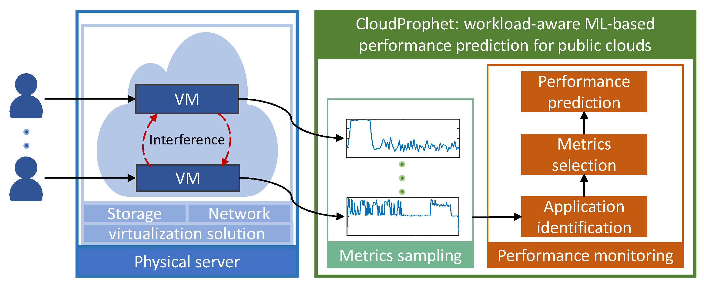

# CloudProphet Dataset



This repo contains the dataset utilized in the research paper titled "CloudProphet: Towards Proactive Resource Provisioning in Cloud Computing," published in IEEE Transactions in Sustainable Computing:

The paper is accessible from [IEEE Xplore](https://ieeexplore.ieee.org/document/10415550). The preprint version is also accessible from the [EPFL Infoscience](https://infoscience.epfl.ch/record/307296?ln=en)

## Directory Structure
Below is an description of the contents within this repository:

- `data/`
    - data_mean_time_diff.mat
        - This file contains the timing synchronization data between Virtual Machine (VM) hardware metrics and application performance metrics, which is needed for the `get_data_dyn_exp_release.m` script.
- `exp_results_dyn/`
    - It contains the original sampled traces from the physical server, VMs, and the application operating on them. More specifically, it contains the following subdirectories:
        - `exp_v*/`
            - Dynamic scenario experiments, with each folder containing experiment traces spanning around 10 hours.
            - `output_*.tar.gz`
                - Compressed archives of VM hardware metrics.
            - `re_vm*.tar.gz`
                - Compressed archives of the runtime and performance information of each application.

- `get_data_dyn_exp_release.m`
    - A MATLAB script dedicated to processing the VM metrics and application performance data.
- `sub_get_vm_stats_v2_release.m`
    - A MATLAB function used by `get_data_dyn_exp_release.m` to process the VM metrics.
- `LICENSE`  
    - License file.

- `README.md`
    - This file.

## Benchmark used in the experiments

The following table lists the applications used in CloudProphet experiments:

| app_num | app_name            | link                                                      |
|---------|---------------------|-----------------------------------------------------------|
| 1       | web serving         | https://www.cloudsuite.ch/                                |
| 2       | media streaming     | https://www.cloudsuite.ch/                                |
| 3       | in-memory analytics | https://www.cloudsuite.ch/                                |
| 4       | data serving        | https://www.cloudsuite.ch/                                |
| 5       | redis-benchmark     | https://redis.io/docs/management/optimization/benchmarks/ |

## How-to
1. First extract every `output_*.tar.gz` and `re_vm*.tar.gz` file in the `exp_results_dyn` directory.

2. Then, run the `get_data_dyn_exp_release.m` script to process the data.

3. The output will be 5 data files for the 5 dynamic experiments: data_app_vm_stats_dynexp[X].mat, which contains the application performance and VM hardware metrics.

    For instance, the generated `data_app_vm_stats_dynexp**08**.mat` file summarizes the metrics for the application and VM metrics located in folder `exp_v**08**/`. Five variables (benchmarks) are included in this mat file. For example, `results_col_ds_all` contains the processed data for benchmark data serving (DS). This variable is a cell with 5 rows and 3 columns. The rows indicate different runs on different VMs, as there are 5 VMs in the experiments, so there are 5 rows. The columns are for different summarized metrics.
    The first column is the application performance metrics, the second column is the mean VM hardware metrics during the application's execution, and the third column is the sum of VM hardware metrics during the application's execution. For more information, please refer to `get_data_dyn_exp_release.m` for more information on how these data are processed and saved.

4. Machine learning models can be trained using the VM metrics data to predict the application performance metrics appearing in the first column.

## Citation
If you use this dataset in your research, please cite the following paper:

```
D. Huang, L. Costero, A. Pahlevan, M. Zapater and D. Atienza, "CloudProphet: A Machine Learning-Based Performance Prediction for Public Clouds," in IEEE Transactions on Sustainable Computing, doi: 10.1109/TSUSC.2024.3359325.
```